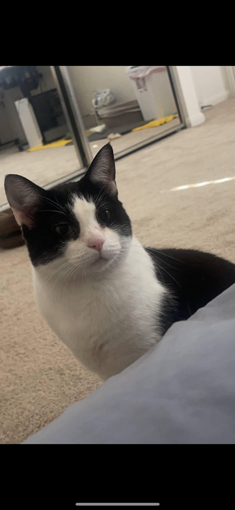

# Welcome to My User Page

## About Me as a Programmer

>Self-introduction 
I'm Jianing Yue, I started learning code four years ago. My first programming language was **Python**, then I learned **JAVA**, and also came into contact with **C** and **C++**. But I don't think I became a software engineer, I didn't complete other programs besides homework. Still trying to become a good programmer then become a SE.

>Courses I am taking or have taken：
```
CSE 15l
CSE 30
CSE 101
CSE 100
CSE 110
CSE 140
CSE 140l
CSE 141
CSE 141l
```

>The site I always use:

A Chinese website: [Cainiaojiaocheng](https://www.runoob.com/)

## About me as a person

>Self-introduction

Also, my name is Jianing Yue, I like playing basketball and biking, also like music. I hava a cat, used to be half cat person and half dog person, but after I have a cat, I'm 80% cat person now. Have been to CA OK NY WA. I like CA most, SD is my favorite city in US. I'm from Shijiazhuang HeBei China. 

Here is a picture of my cat.



